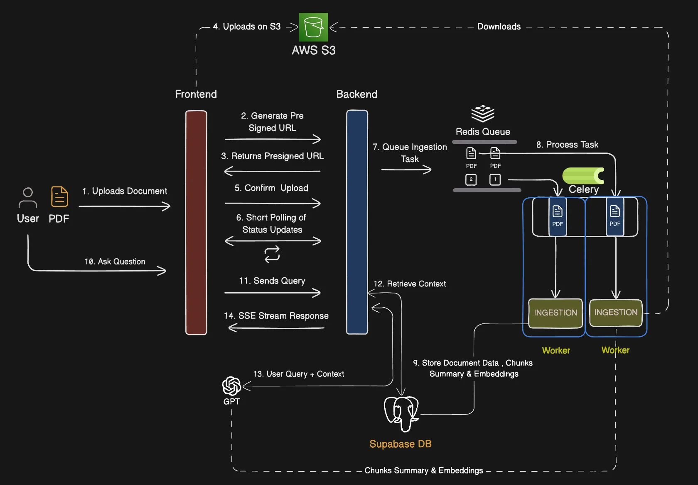
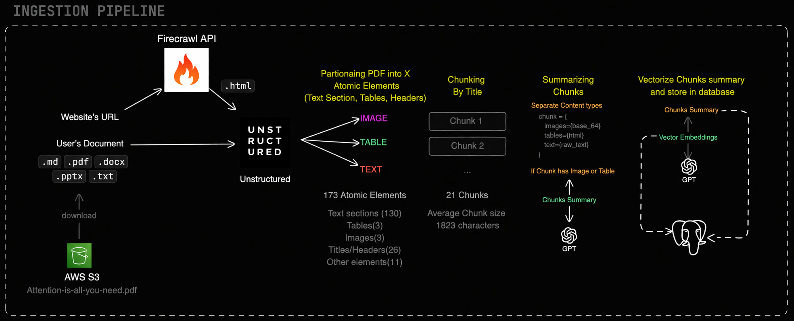
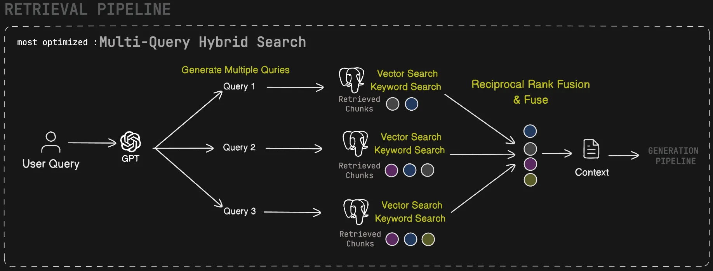
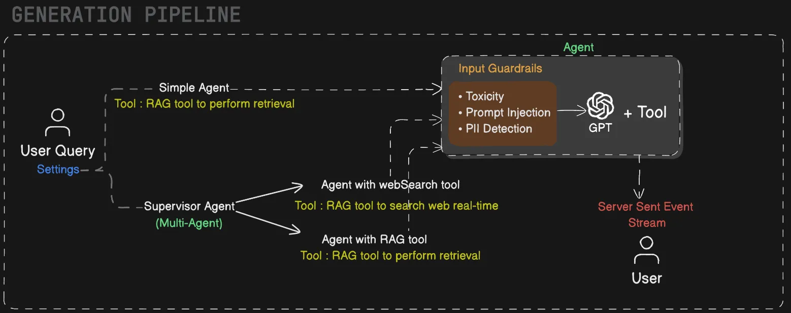

# 🚀 AskDocs — AI-Powered Document Intelligence System

> ⚡ A production-ready **RAG-based multi-agent system** for querying documents with real-time streaming, hybrid search, and scalable ingestion.

---

<p align="center">
  
</p>

---

# 🌟 Key Highlights

- 🧠 **Multi-Agent Architecture** (Supervisor + Tool Agents)
- 🔍 **Hybrid Retrieval (Vector + Keyword + RRF)**
- ⚡ **Async Ingestion Pipeline (Celery + Redis)**
- 📄 **Supports PDFs, DOCX, PPTX, Markdown**
- 🔐 **Built-in Guardrails (PII, Prompt Injection, Toxicity)**
- 📡 **Real-time Streaming Responses (SSE)**
- ☁️ **Cloud-native (AWS S3 + Supabase)**

---

# 🏗️ Architecture Overview

The system is divided into **three core pipelines**:

```text
Ingestion Pipeline  →  Retrieval Pipeline  →  Generation Pipeline
```

---

# 📥 Ingestion Pipeline

<p align="center">
  
</p>

## 🔄 Flow

1. User uploads document
2. Backend generates **pre-signed URL**
3. File stored in **AWS S3**
4. Task pushed to **Redis queue**
5. **Celery workers** process asynchronously
6. Document parsed using **Unstructured**
7. Content split into:
   - Text
   - Tables
   - Images

8. Chunking (title-based segmentation)
9. LLM generates **chunk summaries**
10. Embeddings created
11. Stored in **Supabase Vector DB**

---

## ⚙️ Why this design?

- ✅ Handles large documents efficiently
- ✅ Async processing → no UI blocking
- ✅ Scalable worker-based architecture

---

# 🔍 Retrieval Pipeline

<p align="center">
  
</p>

## 🔄 Flow

1. User query received
2. LLM generates **multiple query variations**
3. Each query performs:
   - 🔎 Vector Search (semantic similarity)
   - 🔑 Keyword Search (exact match)

4. Results fused using:
   - 📊 **Reciprocal Rank Fusion (RRF)**

5. Top-ranked chunks → **context**

---

## 🚀 Why Hybrid Search?

| Method         | Strength               |
| -------------- | ---------------------- |
| Vector Search  | Semantic understanding |
| Keyword Search | Exact matching         |
| RRF Fusion     | Best combined ranking  |

👉 Result: **High accuracy + high recall**

---

# 🤖 Generation Pipeline

<p align="center">
  
</p>

## 🔄 Flow

1. Query enters **Supervisor Agent**
2. Routed to:
   - 📄 RAG Agent (document retrieval)
   - 🌐 Web Search Agent (real-time data)

3. Input passes through **guardrails**:
   - Prompt Injection Detection
   - Toxicity Filtering
   - PII Detection

4. GPT generates response using:
   - Retrieved context
   - External tools

5. Response streamed via **SSE**

---

## 🛡️ Safety Layer

- Prevents malicious prompts
- Protects sensitive data
- Ensures safe AI responses

---

# 🔗 End-to-End Flow

```text
User Upload → S3 → Queue → Worker Processing → DB Storage
User Query → Retrieval → Context → LLM → Streaming Response
```

---

# ⚡ Tech Stack

| Layer       | Technology                       |
| ----------- | -------------------------------- |
| Backend API | FastAPI / Node.js                |
| Queue       | Redis                            |
| Workers     | Celery                           |
| Storage     | AWS S3                           |
| Database    | Supabase (PostgreSQL + pgvector) |
| LLM         | OpenAI GPT                       |
| Parsing     | Unstructured                     |

---
